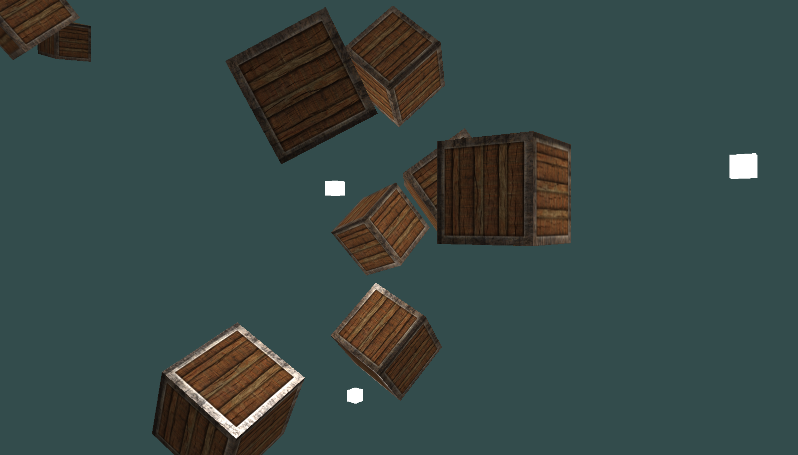

Just playing around with OpenGL, roughly following the books [LearnOpenGL](https://learnopengl.com) and [open.gl]().

## Screenshot (current state)



## Build & Run

```sh
$ make
$ make run
```

## Build requirements

Note: I only tried this under Linux (with Wayland). Under Mac or Windows you are on your own.

### GLFW

- install from package manager (`sudo apt get glfw glfw-dev` unter Ubuntu)

### GLAD

- generate the header and c files here: [https://gen.glad.sh/]()
- download; unzip
- move headers to include directory
- copy glad.c to libs directory (not needed anymore, I'll ship it now; maybe for updates)
